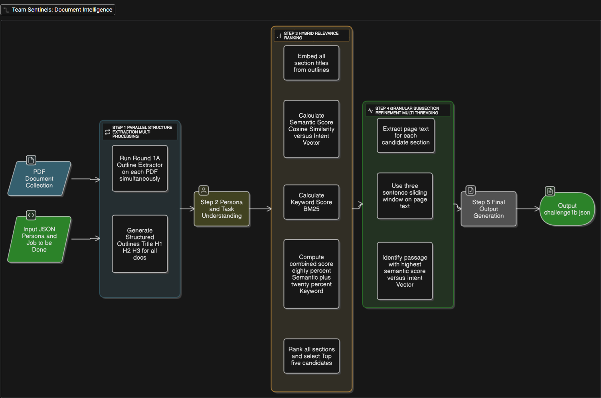

# Document Intelligence System

This repository contains an intelligent document analysis system that extracts and prioritizes the most relevant sections from a collection of PDFs based on a specific user persona and their job-to-be-done. The solution is designed to run entirely offline, leveraging a hybrid approach that combines structural analysis, semantic understanding, and keyword relevance.

## Contributors

- [Saksham Kumar](https://github.com/sakshamkumar04)
- [Aloukik Joshi](https://github.com/aloukikjoshi)
- [Nihal Pandey](https://github.com/nihalpandey)

## Approach


[Link to the Architecture Diagram](https://app.eraser.io/workspace/4nIIsocaIKHcuZmpvEZX?origin=share)

Our solution employs a multi-stage, hybrid pipeline that combines structural document analysis, semantic understanding, and keyword-based relevance to deliver highly contextual results. The process is designed for efficiency and accuracy, running entirely offline.

### 1. Parallel Structure Extraction

- Uses a high-performance outline extractor for document processing.
- Processes all input PDFs in parallel, with each document handled by a separate CPU core.
- Extracts all titles and headings (H1, H2, H3) for each document, serving as candidate sections for relevance ranking.

### 2. Persona & Task Understanding

- Interprets the user's intent by creating a single, powerful vector representation of the combined persona and job-to-be-done.
- Uses the `granite-embedding-107m-multilingual` sentence-transformer model.
- This "intent vector" becomes the semantic benchmark for comparing document sections.

### 3. Hybrid Relevance Ranking

- Employs a hybrid scoring model leveraging both semantic and lexical search:
  - **Semantic Similarity (80% Weight):**
    - Embeds each candidate section's title using the Granite model.
    - Calculates cosine similarity between the section's vector and the user's intent vector.
  - **Keyword Matching (20% Weight):**
    - Uses the BM25 algorithm to score sections based on keywords from the job-to-be-done.
- Combines both scores to produce a robust `combined_score`.
- Selects the top 5 ranked sections for further analysis.

### 4. Granular Subsection Refinement

- For each top-ranked section, extracts the full text from the corresponding pages.
- Analyzes text using a 3-sentence sliding window, scoring each window against the user's intent vector.
- Extracts the most relevant 3-sentence passage as the "refined text."
- This process is multi-threaded for efficiency.

### 5. Final Output Generation

- Aggregates results, including ranked section titles and refined subsection text.
- Formats output into `output.json` with all required metadata.

## Models and Libraries Used

**Models:**

- `sentence-transformers/granite-embedding-107m-multilingual`: Powerful, lightweight sentence embedding model from IBM, used for all semantic analysis tasks. Included locally for offline execution.

**Python Libraries:**

- `torch`: Framework for running the sentence-transformer model.
- `sentence-transformers`: For loading and using the embedding model.
- `rank_bm25`: For keyword-based relevance scoring.
- `pymupdf`: For efficient PDF text extraction.
- `numpy` & `pandas`: For numerical operations and data handling.

All dependencies are listed in [requirements.txt](requirements.txt) and are installed within the Docker container.

## How to Build and Run

The solution is containerized using Docker for a consistent and reproducible environment.

### 1. Build the Docker Image

Navigate to the root directory (where the Dockerfile is located) and run:

```sh
docker build --platform linux/amd64 -t document-intelligence:somerandomidentifier .
```

### 2. Expected Directory Structure

Before running the solution, ensure your directories are organized as follows:

```
root/
├── input/
│   ├── input.json
│   └── PDFs/           # All required PDF documents
├── output/             # Results will be written here (create empty)
├── Dockerfile
├── main.py             # Main script to process input and PDFs
├── ...other files
```

### 3. Run the Solution

After building the image:

1. Create an `input` directory containing in the root directory of your project. Refer to the expected directory structure above.
1. Place `input.json` and a sub-folder `PDFs` with all required documents in your local `input` directory.
1. (Optional) Create an empty local directory for results (e.g., `output`).
1. Run the following command from the directory containing your `input` and `output` folders:

   ```sh
   docker run --rm -v $(pwd)/input:/app/input -v $(pwd)/output:/app/output --network none document-intelligence:somerandomidentifier
   ```

The script inside the container will process the input JSON and PDF collection, and generate `output.json` in `/app/output`.

---

## Output File Format

The output JSON file will have the following structure, found in the `output` directory:

```json
{
	"metadata": {
		"input_documents": [
			"doc1.pdf",
			"doc2.pdf",
			"doc3.pdf",
			"doc4.pdf",
			"doc5.pdf"
		],
		"persona": "User Persona Description",
		"job_to_be_done": "Job to be done, in human language.",
		"processing_timestamp": "2025-07-27T16:40:17.158218+00:00"
	},
	"extracted_sections": [
		{
			"document": "doc1.pdf",
			"section_title": "Title1.",
			"importance_rank": 1,
			"page_number": 1
		}
		// ...more sections...
	],
	"subsection_analysis": [
		{
			"document": "doc1.pdf",
			"refined_text": "Refined text from Doc1, Page 1.",
			"page_number": 1
		}
		// ...more refined passages...
	]
}
```

### Explanation of the Output Structure

- `metadata`: Contains input document names, persona, job-to-be-done, and processing timestamp.
- `extracted_sections`: Array of top-ranked sections across all documents, each with:
  - `document`: PDF filename.
  - `section_title`: Section heading.
  - `importance_rank`: Rank of relevance (lower is higher priority).
  - `page_number`: Page number of the section.
- `subsection_analysis`: Array of refined passages, each with:
  - `document`: PDF filename.
  - `refined_text`: Most relevant passage extracted from the section.
  - `page_number`: Page number of the passage.

## Future Improvements

We plan to further enhance relevance scoring by incorporating additional semantic models and ensemble techniques. The outputs from the current hybrid pipeline will be used as training data to build and refine these models, enabling even more robust and reliable extraction of document insights.

## Acknowledgments

This solution was realized with the support of Gemini, Perplexity, and GitHub Chat, which assisted the team in research, planning, implementation, and refining the solution and final submission.

## Copyright

© Contributors (Saksham Kumar, Aloukik Joshi, Nihal Pandey).  
All rights reserved.  
Unauthorized copying, distribution, or use of this code or documentation is strictly prohibited and liable to legal action.

---
